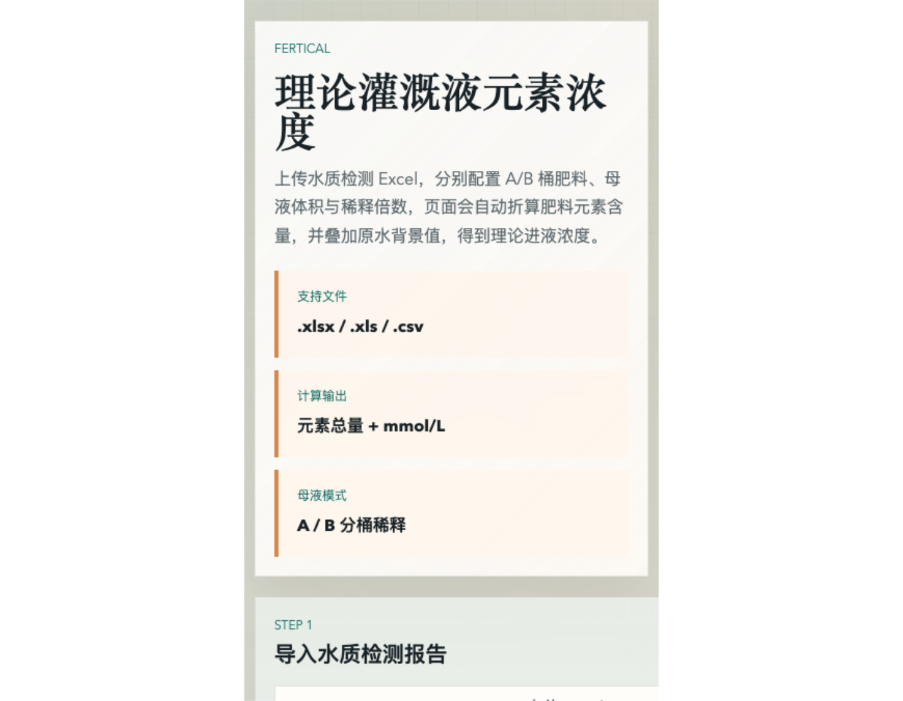

# FertiCal

**Theoretical Irrigation Solution Element Concentration Calculator**

A browser-based tool for calculating element concentrations in irrigation working solutions. Designed for soilless cultivation, fertigation formula verification, and A/B stock solution recipe review.



## Features

- Upload `.xlsx`, `.xls`, or `.csv` water quality analysis reports
- Automatically detect common water quality parameters: `Ca`, `Mg`, `NO3-N`, `NH4-N`, `HCO3-`, `EC`, `pH`, and more (20 parameters supported)
- Configure A-tank and B-tank fertilizers independently — select from a built-in catalog of 17 common fertilizers
- Set stock solution volume (L) and dilution factor for each tank
- Calculate total element mass (g) per tank
- Convert theoretical irrigation concentration to `mmol/L` for direct comparison
- Set target element concentrations; deviations exceeding `15%` are highlighted in red
- Evaluate precipitation risk in A/B stock solutions — computes ion product vs. reference Ksp for `CaSO4` and `Ca3(PO4)2`
- Editable background water values — manually adjust any detected value

## Screenshots

The page is organized into four main areas:

1. **Step 1 — Water Quality Report** — upload and review background water element values
2. **Step 2 — Tank A Stock Solution** — select fertilizers, set amounts, stock volume & dilution
3. **Step 3 — Tank B Stock Solution** — same configuration for the B tank
4. **Step 4 — Results** — element totals, theoretical irrigation concentrations, target deviation analysis, and precipitation risk assessment

## Quick Start

### Open directly

Open `index.html` in any modern browser — no build step required.

### Install dependencies

```bash
npm install
```

The only dependency is `xlsx` for client-side Excel file parsing.

## Usage

1. In the **Water Quality Report** section, upload your `.xlsx`, `.xls`, or `.csv` file.
2. Review and manually correct any detected background element values as needed.
3. In **Tank A** and **Tank B**, add fertilizers from the built-in catalog. For each fertilizer, set:
   - Type (17 pre-configured fertilizers covering Ca(NO3)2, KNO3, KH2PO4, MgSO4, and more)
   - Amount (kg or g)
   - Stock solution volume (L)
   - Dilution factor (x)
4. Optionally, enter **target values** for each element.
5. View results:
   - **A/B Element Totals** — total mass of each element in grams
   - **Theoretical Irrigation Concentration** — water background + A contribution + B contribution, with target comparison
   - **Deviation Alerts** — elements with >15% deviation are marked in red
   - **Precipitation Risk** — ion product vs. Ksp for CaSO4 and Ca3(PO4)2 in each tank

## Calculation Logic

### Element Totals

For each fertilizer, the mass of each element is calculated from the fertilizer's elemental percentage composition and the applied amount. Results are summed per tank.

### Theoretical Irrigation Concentration

1. **Stock solution concentration**: total element mass (mg) ÷ stock solution volume (L) → mg/L in the stock tank
2. **Irrigation concentration**: stock solution concentration ÷ dilution factor → mg/L in the working solution
3. **Final value**: irrigation concentration + background water value → theoretical irrigation concentration

Macronutrient results are displayed in `mmol/L` (converted using molar mass). `EC` and `pH` retain their original units.

### Target Deviation

When a target value is set:

```
Deviation = (theoretical value - target value) / target value
```

If the absolute deviation exceeds 15%, both the theoretical value and deviation percentage are displayed in red.

### Precipitation Risk

The tool evaluates potential salt precipitation in the stock solution by calculating ionic products for two sparingly soluble salts:

- **CaSO4**: Ion product = [Ca²⁺] × [SO₄²⁻] (mol/L), Ksp = 2.4×10⁻⁵
- **Ca3(PO4)₂**: Ion product = [Ca²⁺]³ × [PO₄³⁻]² (mol/L), Ksp = 2.07×10⁻³³

Background water Ca, S, and P values are included in the stock solution ion concentration before calculation.

## Project Structure

```
FertiCal/
├── assets/
│   └── fertical-home.svg     # Screenshot
├── index.html                # Main page
├── styles.css                # Stylesheet
├── app.js                    # Application logic (vanilla JS, no framework)
├── package.json              # npm config
├── package-lock.json
├── README.md                 # Chinese documentation
└── README_EN.md              # English documentation (this file)
```

## Built-in Fertilizer Catalog

The app includes 17 pre-configured fertilizers organized by compatibility:

| Fertilizer | Tank | Key Elements |
|---|---|---|
| Calcium Nitrate Tetrahydrate (Ca(NO₃)₂·4H₂O) | A | NO₃-N, Ca |
| Magnesium Nitrate Hexahydrate (Mg(NO₃)₂·6H₂O) | A | NO₃-N, Mg |
| Calcium Ammonium Nitrate (5Ca(NO₃)₂·NH₄NO₃·10H₂O) | A | NH₄-N, NO₃-N, Ca |
| Calcium Chloride (CaCl₂) | A | Ca, Cl |
| Potassium Nitrate (KNO₃) | A/B | NO₃-N, K |
| Potassium Chloride (KCl) | A/B | K, Cl |
| EDDHA-Fe-11% | A | Fe |
| Nitric Acid 40% (HNO₃) | A | NO₃-N |
| Monopotassium Phosphate (KH₂PO₄) | B | P, K |
| Magnesium Sulfate Heptahydrate (MgSO₄·7H₂O) | B | Mg, S |
| Potassium Sulfate (K₂SO₄) | B | K, S |
| Manganese Sulfate Monohydrate (MnSO₄·H₂O) | B | Mn, S |
| Borax Decahydrate (Na₂B₄O₇·10H₂O) | B | B, Na |
| Zinc Sulfate Heptahydrate (ZnSO₄·7H₂O) | B | Zn, S |
| Copper Sulfate Pentahydrate (CuSO₄·5H₂O) | B | Cu, S |
| Sodium Molybdate (Na₂MoO₄) | B | Mo, Na |
| Phosphoric Acid 85% (H₃PO₄) | B | P |

Fertilizers marked "A/B" can be used in either tank.

## Dependencies

- [`xlsx`](https://www.npmjs.com/package/xlsx) — client-side Excel file parsing

## Use Cases

- Soilless cultivation nutrient formula calculation
- A/B stock solution formulation and verification
- Theoretical irrigation assessment under different water source backgrounds
- Target concentration comparison and formula fine-tuning

## Future Directions

- Custom fertilizer library import and save
- Save target value schemes as templates
- Add "too high / too low" labels
- Export calculation results as Excel or PDF
